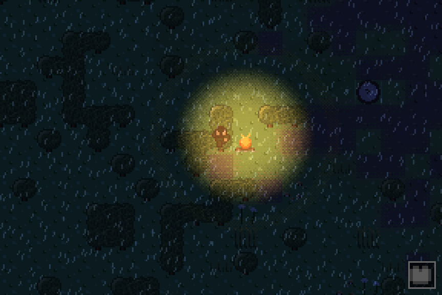
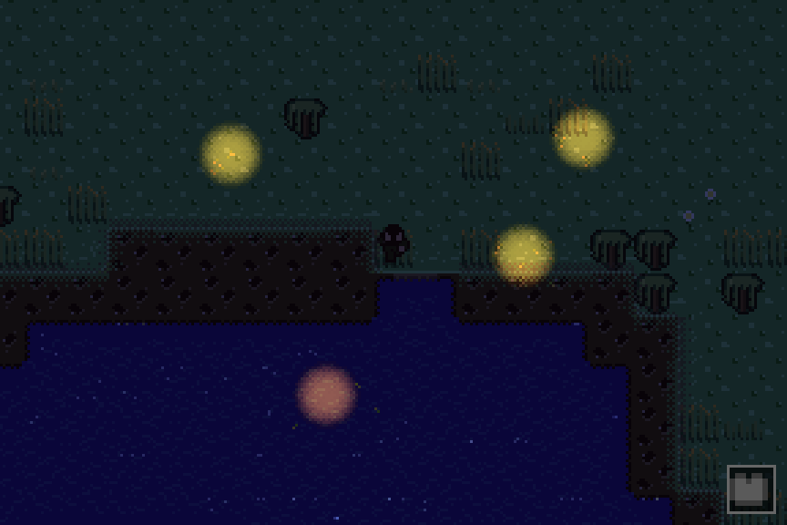
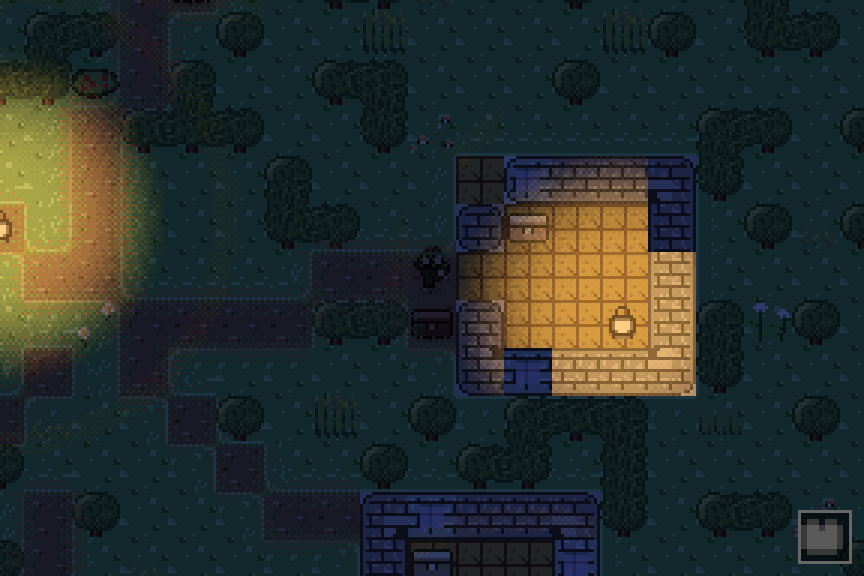
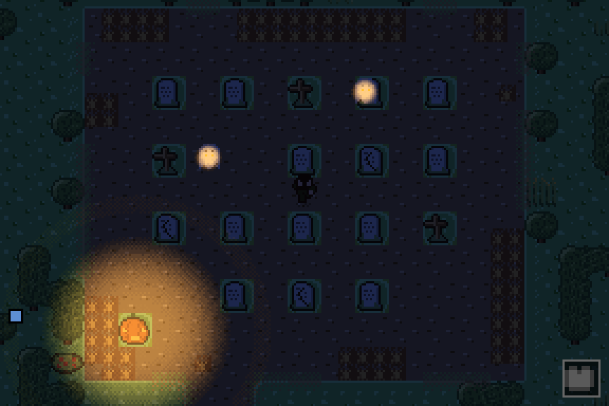
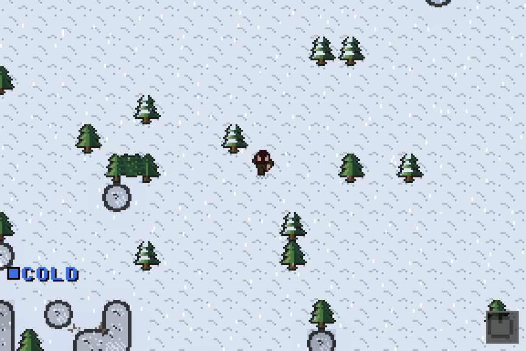
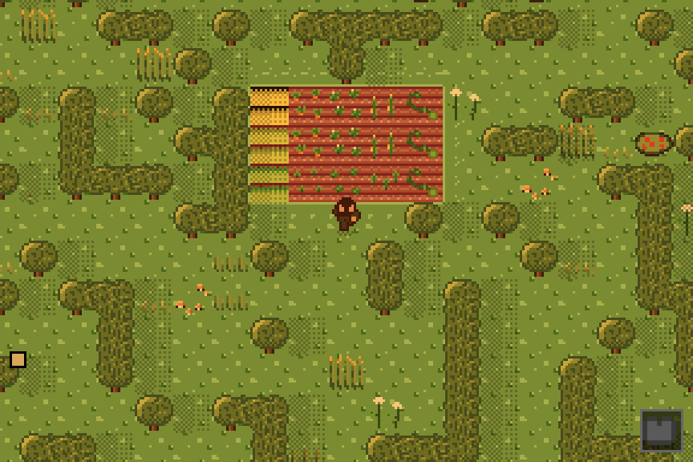

# Fossickers Doom (fdoom.rs)

An original open-sandbox survival game in pure Rust — no engine, no GPU, just
`winit` + `softbuffer` + `rodio` and a 288x192 software-rendered framebuffer.
Infinite deterministic worlds, dig-based descent, fossicking, weather that
matters, and places with mood: think scavenge-and-survive in the DayZ /
7-Days-to-Die family, kept approachable enough that a kid can bumble through
day one. No win condition — the world is the game.



| | |
|---|---|
|  |  |
|  |  |

*All shots are in-engine renders from seed 1 at 3x — worlds are infinite and
fully described by their seed.*

## The world

- **Infinite, deterministic terrain** streamed in chunks around you: everything
  derives from `(seed, depth, x, y)`, chunk-border exact, no global state.
- **Climate-coherent biomes** — canopied forests, marshes, heath highlands,
  tundra, savanna, desert — with flora on its true ground and blended seams.
- **Structures with history**: towns age from overgrown ruins to settled
  hamlets with lit windows; cemeteries decay; ruins, camps, standing stones and
  old trails thread the wilds. Containers are searchable — the scavenge chain
  (bottles, cans, tin) starts there.
- **Five layers, no stairs**: surface, three mine layers, and a dungeon
  set-piece. You dig down and climb back on the ladder you leave.
- **Tides** on the coasts, and rare world events on their own calendar:
  Hollow Night, Aurora, Ember Rain, Whisper Fog, the Caravan.

## Survival



- **Gather-chain crafting from bare hands**: punch grass for fibers, twist
  cord, knap stone sharp, lash your first crude tools — then workbench, oven,
  furnace, anvil.
- **Farming and cooking**: till, plant world-sourced seeds (wheat, carrots,
  potatoes, corn, pumpkins), let the rain water the field, cook at a campfire
  or oven.
- **Temperature that matters**: hot and cold bands push you toward fur coats,
  straw hats, shade, and fire — telegraphed early, mitigated cheaply.
- **Weather with consequences**: rain douses flames and waters crops, snow
  settles and thaws, morning mist rises off the marshes, golden-hour haze.
- **Fossicking identity**: pan the creeks, chase ore veins through cracked and
  dense rock, prop your tunnels with timber — or gamble with cave-ins.
  Excavation merges pits into channels; channels flood into pools.
- **An original mob roster**: snakes, stamina-draining ghosts, marsh lurkers,
  feral hounds, stone golems, night wisps, fireflies, glow worms — plus
  invisible fish that only bubbles betray.
- **Day/night lighting with occlusion**, a frameless HUD, one E-key survival
  screen (pack / wear / craft / self), and a map drawn from explored chunks.

## Quickstart

```sh
cargo run                # play
cargo run -- --debug     # cheat keys + dev console (see docs/DEV_GUIDE.md)
just check               # fmt + clippy -D warnings + full test suite
just --list              # every dev verb (worldview, studio, soak, shots...)
```

Requires stable Rust 1.85+. No system dependencies beyond audio output — and
the game runs fine (silently) without one.

## Controls

Defaults live in `init_key_map` (`src/core/io/input_handler.rs`); rebind
in-game under Options → Change Key Bindings.

| Action | Key(s) |
|---|---|
| Move | `W A S D` / arrows |
| Attack / use held item | `SPACE` / `C` |
| Survival screen (pack, wear, craft, self) | `E` / `I` |
| Jump straight to the craft tab | `Z` / `SHIFT-E` |
| Stash held item | `X` |
| Pick up furniture | `V` |
| Drop one / drop stack | `Q` / `SHIFT-Q` |
| Map (explored chunks) | `M` |
| Save world | `R` |
| Potion effects / player info | `P` / `SHIFT-I` |
| Pause / menus | `ESCAPE`, `ENTER` |
| FPS overlay | `F3` |

With `--debug` only: `F4` info overlay, `/` dev console (`give`, `tp`, `time`,
`heal`), `N` skip to night, `SHIFT-S`/`SHIFT-C` survival/creative — plus the
cheat keys in [docs/DEV_GUIDE.md](docs/DEV_GUIDE.md#debug-cheat-keys).

## Dev tooling

- **`FDOOM_DEMO` scripted runs** — drive the real windowed game from an env-var
  script (keys, waits, frame dumps) for hands-off verification.
- **`cargo run --bin worldview -- <seed>`** — inspect any seed's biomes,
  structures and trails without playing; headless `--dump` mode for CI.
- **`cargo run --bin pixel_studio`** — the in-repo pixel-art editor;
  `assets/sprites/**` PNGs are the art source of truth, stitched into a runtime
  atlas at boot.
- **Headless testing** — the core never touches the platform layer;
  `fdoom::testutil::TestWorld` boots a world, ticks it, and renders PNGs with
  no window. Long randomized soaks via `just soak`.
- Saves are versioned text files under `~/fdoom` (macOS), `%APPDATA%\fdoom`
  (Windows) or `~/.fdoom` (Linux), with autosave and old-save tolerance.

## Lineage

The project began as a faithful 1:1 port of the Java game
[Fossicker](https://github.com/binbandit/Fossicker) — **tag `v0.1.0` is the
pure port** (byte-identical rendering and world gen versus the JVM). Everything
since evolves the game on its own terms: infinite worlds, the survival systems
above, an original art pass, and a new deterministic RNG. `PORTING.md` records
the port-era architecture decisions.

## Documentation

- [docs/ARCHITECTURE.md](docs/ARCHITECTURE.md) — 15-minute codebase tour
- [docs/TERRAIN.md](docs/TERRAIN.md), [docs/ENTITIES.md](docs/ENTITIES.md),
  [docs/ITEMS_AND_CRAFTING.md](docs/ITEMS_AND_CRAFTING.md),
  [docs/RENDERING_AND_UI.md](docs/RENDERING_AND_UI.md),
  [docs/CORE_AND_SAVES.md](docs/CORE_AND_SAVES.md) — per-system references
- [docs/DEV_GUIDE.md](docs/DEV_GUIDE.md) — daily commands, scripted runs,
  headless testing, cheat keys, troubleshooting
- [docs/ADDING_CONTENT.md](docs/ADDING_CONTENT.md) — recipes for new items,
  tiles, mobs, sprites
- [docs/ART_GUIDE.md](docs/ART_GUIDE.md) — the house pixel-art style
